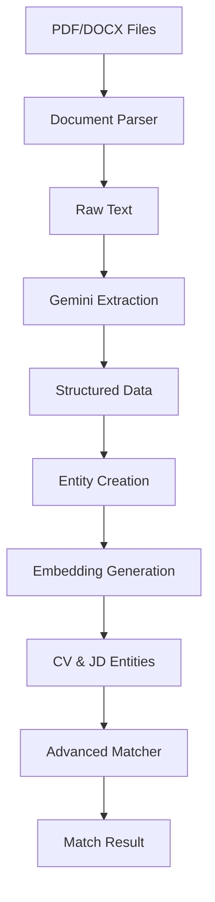

# Smart Recruitment Assistant - Data Flow Documentation

This document describes the complete data flow from uploading CV and Job Description files to generating match results, including all functions used at each step.

---

## Overview



---

## Detailed Data Flow

### Phase 1: Document Parsing
**Input:** PDF or DOCX files  
**Output:** Raw text string

#### Functions Used

**[`extract_text_from_pdf()`](file:///c:/Users/yassi/Desktop/SmartRecru/src/utils/documents.py)**
- **Location:** `src/utils/documents.py`
- **Purpose:** Extract text from PDF files using PyPDF2
- **Input:** File path or file-like object
- **Output:** Raw text string
- **Process:**
  1. Opens PDF file with `PdfReader`
  2. Iterates through all pages
  3. Extracts text from each page
  4. Concatenates all page texts

**[`extract_text_from_docx()`](file:///c:/Users/yassi/Desktop/SmartRecru/src/utils/documents.py)**
- **Location:** `src/utils/documents.py`
- **Purpose:** Extract text from DOCX files using python-docx
- **Input:** File path or file-like object
- **Output:** Raw text string
- **Process:**
  1. Opens DOCX file with `Document`
  2. Iterates through all paragraphs
  3. Extracts text from each paragraph
  4. Joins paragraphs with newlines

**[`extract_text()`](file:///c:/Users/yassi/Desktop/SmartRecru/src/utils/documents.py)**
- **Location:** `src/utils/documents.py`
- **Purpose:** Universal text extractor (auto-detects file type)
- **Input:** File path or file-like object
- **Output:** Raw text string
- **Process:**
  1. Detects file extension (.pdf or .docx)
  2. Routes to appropriate extractor function
  3. Returns extracted text

**Example:**
```python
from src.utils.documents import extract_text

# Extract from CV
cv_text = extract_text("candidate_cv.pdf")
# Output: "John Doe\nSoftware Engineer\n..."

# Extract from Job Description
jd_text = extract_text("job_offer.docx")
# Output: "Senior Developer\nCompany: TechCorp\n..."
```

---

### Phase 2: Information Extraction (Gemini AI)
**Input:** Raw text string  
**Output:** Structured dictionary

#### Functions Used

**[`extract_information_from_cv_gemini()`](file:///c:/Users/yassi/Desktop/SmartRecru/src/extraction.py)**
- **Location:** `src/extraction.py`
- **Purpose:** Extract structured information from CV text using Gemini AI
- **Input:** Raw CV text string
- **Output:** Dictionary with CV fields
- **Process:**
  1. Constructs detailed prompt for Gemini
  2. Calls `genai_model.generate_content(prompt)`
  3. Cleans response (removes markdown code fences)
  4. Parses JSON response
  5. Returns structured dictionary

**Output Structure:**
```json
{
  "name": "John Doe",
  "contact": {
    "email": "john@example.com",
    "phone": "+1234567890"
  },
  "skills": ["Python", "JavaScript", "Docker"],
  "experience": ["Software Engineer at Google (2020-2023)"],
  "education": ["Master of CS, Stanford University"],
  "diplomas": ["MSc Computer Science"],
  "academic_projects": []
}
```

**[`extract_information_from_jd_gemini()`](file:///c:/Users/yassi/Desktop/SmartRecru/src/extraction.py)**
- **Location:** `src/extraction.py`
- **Purpose:** Extract structured information from Job Description using Gemini AI
- **Input:** Raw job description text
- **Output:** Dictionary with JD fields
- **Process:**
  1. Constructs detailed prompt for Gemini
  2. Calls `genai_model.generate_content(prompt)`
  3. Cleans response (removes markdown code fences)
  4. Parses JSON response
  5. Returns structured dictionary

**Output Structure:**
```json
{
  "job_title": "Senior Full-Stack Developer",
  "company_name": "TechCorp",
  "location": "San Francisco, CA",
  "job_type": "Full-time",
  "responsibilities": ["Design web applications", "Code reviews"],
  "skills": ["React", "Node.js", "PostgreSQL"],
  "experience_level": "5+ years",
  "education_requirements": ["Bachelor's in CS"]
}
```

---

### Phase 3: Entity Creation & Validation
**Input:** Structured dictionary + raw text  
**Output:** CV or JobDescription entity objects

#### Functions Used

**[`dict_to_cv()`](file:///c:/Users/yassi/Desktop/SmartRecru/src/utils/integration.py)**
- **Location:** `src/utils/integration.py`
- **Purpose:** Convert extraction dictionary to CV entity
- **Input:** Dictionary + raw text
- **Output:** CV object
- **Process:**
  1. Extracts contact information
  2. Cleans and validates skills using `SkillValidator`
  3. Deduplicates skills
  4. Creates CV entity with all fields
  5. Returns populated CV object

**[`dict_to_jd()`](file:///c:/Users/yassi/Desktop/SmartRecru/src/utils/integration.py)**
- **Location:** `src/utils/integration.py`
- **Purpose:** Convert extraction dictionary to JobDescription entity
- **Input:** Dictionary + raw text
- **Output:** JobDescription object
- **Process:**
  1. Cleans and validates skills using `SkillValidator`
  2. Deduplicates skills
  3. Creates JobDescription entity with all fields
  4. Returns populated JobDescription object

**Helper Classes:**

**`SkillValidator`** ([validation.py](file:///c:/Users/yassi/Desktop/SmartRecru/src/utils/validation.py))
- `clean_skills()` - Removes empty/invalid skills
- `deduplicate_skills()` - Removes duplicates (case-insensitive)

---

### Phase 4: Embedding Generation
**Input:** Raw text  
**Output:** Vector embedding (numpy array)

#### Functions Used

**[`generate_embeddings()`](file:///c:/Users/yassi/Desktop/SmartRecru/src/utils/embeddings.py)**
- **Location:** `src/utils/embeddings.py`
- **Purpose:** Generate semantic embeddings using sentence transformers
- **Input:** List of texts
- **Output:** List of numpy arrays (embeddings)
- **Process:**
  1. Loads pre-trained model (all-MiniLM-L6-v2)
  2. Encodes text to vector representation
  3. Returns normalized embeddings

**Example:**
```python
from src.utils.embeddings import generate_embeddings

texts = ["Software engineer with Python experience"]
embeddings = generate_embeddings(texts)
# Output: [array([0.023, -0.145, ..., 0.089])]  # 384-dimensional vector
```

---

### Phase 5: Complete Entity Extraction (High-Level)
**Input:** Raw CV/JD text  
**Output:** Complete CV/JD entity with embedding

#### Functions Used

**[`extract_cv_to_entity()`](file:///c:/Users/yassi/Desktop/SmartRecru/src/utils/integration.py)**
- **Location:** `src/utils/integration.py`
- **Purpose:** End-to-end CV extraction and entity creation
- **Input:** CV text string
- **Output:** Complete CV entity with embedding
- **Process:**
  1. Calls `extract_information_from_cv_gemini(cv_text)`
  2. Calls `dict_to_cv(data, cv_text)`
  3. Calls `generate_embeddings([cv_text])`
  4. Attaches embedding to CV entity
  5. Returns complete CV entity

**[`extract_jd_to_entity()`](file:///c:/Users/yassi/Desktop/SmartRecru/src/utils/integration.py)**
- **Location:** `src/utils/integration.py`
- **Purpose:** End-to-end JD extraction and entity creation
- **Input:** JD text string
- **Output:** Complete JobDescription entity with embedding
- **Process:**
  1. Calls `extract_information_from_jd_gemini(jd_text)`
  2. Calls `dict_to_jd(data, jd_text)`
  3. Calls `generate_embeddings([jd_text])`
  4. Attaches embedding to JD entity
  5. Returns complete JobDescription entity

---

### Phase 6: Advanced Matching
**Input:** CV entity + JobDescription entity  
**Output:** MatchResult with comprehensive analysis

#### Functions Used

**[`AdvancedMatcher.match()`](file:///c:/Users/yassi/Desktop/SmartRecru/src/matching/matcher.py)**
- **Location:** `src/matching/matcher.py`
- **Purpose:** Perform multi-dimensional matching
- **Input:** CV entity, JobDescription entity
- **Output:** MatchResult object
- **Process:**
  1. **Semantic Matching:**
     - Calls `_calculate_semantic_score(cv, jd)`
     - Uses `calculate_fit_score()` for cosine similarity
  
  2. **Skill Matching:**
     - Calls `SkillMatcher.match_skills(cv_skills, jd_skills)`
     - Returns matched skills, missing skills, match details
  
  3. **Experience Matching:**
     - Calls `_match_experience(cv, jd)`
     - Compares years of experience
  
  4. **Education Matching:**
     - Calls `_match_education(cv, jd)`
     - Matches education levels
  
  5. **Score Calculation:**
     - Combines all dimensions with weighted average
     - Generates strengths, weaknesses, recommendations
  
  6. Returns comprehensive MatchResult

**[`SkillMatcher.match_skills()`](file:///c:/Users/yassi/Desktop/SmartRecru/src/matching/skills.py)**
- **Location:** `src/matching/skills.py`
- **Purpose:** Advanced skill matching with multiple strategies
- **Input:** CV skills list, JD skills list
- **Output:** Tuple (matched_skills, missing_skills, match_details)
- **Process:**
  1. **Exact Match:** Checks normalized skill names
  2. **Fuzzy Match:** Uses `fuzzywuzzy` for similar skills
  3. **Semantic Match:** Uses embeddings for semantic similarity
  4. Returns detailed match information

**[`calculate_fit_score()`](file:///c:/Users/yassi/Desktop/SmartRecru/src/matching/scoring.py)**
- **Location:** `src/matching/scoring.py`
- **Purpose:** Calculate cosine similarity between embeddings
- **Input:** CV embedding, JD embedding
- **Output:** Similarity score (0.0 to 1.0)
- **Process:**
  1. Reshapes embeddings if needed
  2. Calculates cosine similarity
  3. Returns float score

---

### Phase 7: Quick Match (One-Step API)
**Input:** Raw CV text + raw JD text  
**Output:** Complete MatchResult

#### Functions Used

**[`quick_match()`](file:///c:/Users/yassi/Desktop/SmartRecru/src/utils/integration.py)**
- **Location:** `src/utils/integration.py`
- **Purpose:** End-to-end matching in one function call
- **Input:** CV text, JD text
- **Output:** MatchResult
- **Process:**
  1. Calls `extract_cv_to_entity(cv_text)`
  2. Calls `extract_jd_to_entity(jd_text)`
  3. Calls `match_cv_to_jd(cv, jd)`
  4. Returns MatchResult

**[`match_cv_to_jd()`](file:///c:/Users/yassi/Desktop/SmartRecru/src/utils/integration.py)**
- **Location:** `src/utils/integration.py`
- **Purpose:** Match CV to JD using AdvancedMatcher
- **Input:** CV entity, JD entity, optional weights
- **Output:** MatchResult
- **Process:**
  1. Creates `AdvancedMatcher` instance
  2. Calls `matcher.match(cv, jd)`
  3. Returns MatchResult

---

## Complete End-to-End Flow

### Example Usage

```python
from src.utils.documents import extract_text
from src.utils.integration import quick_match

# Step 1: Extract text from files
cv_text = extract_text("john_doe_cv.pdf")
jd_text = extract_text("senior_developer_jd.docx")

# Step 2: Quick match (handles everything)
result = quick_match(cv_text, jd_text)

# Step 3: Access results
print(f"Match Score: {result.total_score}%")
print(f"Grade: {result.get_grade()}")
print(f"Matched Skills: {result.matched_skills}")
print(f"Missing Skills: {result.missing_skills}")
```

### Detailed Step-by-Step Flow

```python
from src.utils.documents import extract_text
from src.extraction import extract_information_from_cv_gemini, extract_information_from_jd_gemini
from src.utils.integration import dict_to_cv, dict_to_jd
from src.utils.embeddings import generate_embeddings
from src.matching.matcher import AdvancedMatcher

# 1. Document Parsing
cv_text = extract_text("cv.pdf")           # → Raw text
jd_text = extract_text("job.docx")         # → Raw text

# 2. Information Extraction (Gemini)
cv_data = extract_information_from_cv_gemini(cv_text)    # → Dictionary
jd_data = extract_information_from_jd_gemini(jd_text)    # → Dictionary

# 3. Entity Creation
cv = dict_to_cv(cv_data, cv_text)          # → CV object
jd = dict_to_jd(jd_data, jd_text)          # → JobDescription object

# 4. Embedding Generation
cv.embedding = generate_embeddings([cv_text])[0]   # → numpy array
jd.embedding = generate_embeddings([jd_text])[0]   # → numpy array

# 5. Matching
matcher = AdvancedMatcher()
result = matcher.match(cv, jd)             # → MatchResult

# 6. Results
print(f"Total Score: {result.total_score}%")
print(f"Semantic Score: {result.semantic_score}")
print(f"Skill Match Ratio: {result.skill_match_ratio}")
print(f"Experience Score: {result.experience_score}")
print(f"Education Score: {result.education_score}")
```

---

## Data Structures

### CV Entity
```python
CV(
    raw_text: str,
    name: str,
    contact: dict,                    # {"email": "...", "phone": "..."}
    skills: List[str],
    education: List[str],
    experience: List[str],
    diplomas: List[str],
    academic_projects: List[str],
    embedding: np.ndarray             # 384-dimensional vector
)
```

### JobDescription Entity
```python
JobDescription(
    raw_text: str,
    job_title: str,
    company_name: str,
    location: str,
    job_type: str,
    responsibilities: List[str],
    skills: List[str],
    experience_level: str,
    education_requirements: List[str],
    embedding: np.ndarray             # 384-dimensional vector
)
```

### MatchResult Entity
```python
MatchResult(
    cv: CV,
    job_description: JobDescription,
    total_score: float,               # 0-100 percentage
    semantic_score: float,            # 0.0-1.0
    skill_match_ratio: float,         # 0.0-1.0
    matched_skills: List[str],
    missing_skills: List[str],
    experience_score: float,          # 0.0-1.0
    education_score: float,           # 0.0-1.0
    strengths: List[str],
    weaknesses: List[str],
    recommendations: List[str],
    match_details: Dict               # Skill-level match info
)
```

---

## Function Call Hierarchy

```
quick_match()
├── extract_cv_to_entity()
│   ├── extract_information_from_cv_gemini()
│   │   └── genai_model.generate_content()
│   ├── dict_to_cv()
│   │   ├── SkillValidator.clean_skills()
│   │   └── SkillValidator.deduplicate_skills()
│   └── generate_embeddings()
│
├── extract_jd_to_entity()
│   ├── extract_information_from_jd_gemini()
│   │   └── genai_model.generate_content()
│   ├── dict_to_jd()
│   │   ├── SkillValidator.clean_skills()
│   │   └── SkillValidator.deduplicate_skills()
│   └── generate_embeddings()
│
└── match_cv_to_jd()
    └── AdvancedMatcher.match()
        ├── _calculate_semantic_score()
        │   └── calculate_fit_score()
        ├── SkillMatcher.match_skills()
        │   ├── normalize_skill()
        │   ├── fuzzy matching (fuzzywuzzy)
        │   └── generate_embeddings() (for semantic matching)
        ├── _match_experience()
        ├── _match_education()
        ├── _generate_strengths()
        ├── _generate_weaknesses()
        └── _generate_recommendations()
```

---

## Key Technologies

- **Document Parsing:** PyPDF2, python-docx
- **AI Extraction:** Google Generative AI (Gemini 2.5 Flash)
- **Embeddings:** Sentence Transformers (all-MiniLM-L6-v2)
- **Skill Matching:** fuzzywuzzy, semantic similarity
- **Scoring:** Cosine similarity (scikit-learn)

---

## Performance Considerations

- **Gemini API Calls:** 2 per match (1 for CV, 1 for JD)
- **Embedding Generation:** 2 per match (cached in entities)
- **Skill Matching:** O(n*m) worst case with semantic fallback
- **Total Processing Time:** ~2-5 seconds per match (depending on file size and API latency)

---

## Error Handling

All extraction functions include error handling:
- **Document parsing errors:** Returns empty string or raises exception
- **Gemini extraction errors:** Raises `RuntimeError` with detailed message
- **JSON parsing errors:** Raises `json.JSONDecodeError`
- **Embedding errors:** Falls back or raises exception based on context

---

## Next Steps

For developers looking to extend the system:
1. **Add new extraction fields:** Modify Gemini prompts in `extraction.py`
2. **Add new matching dimensions:**  Extend `AdvancedMatcher` class
3. **Customize scoring weights:** Pass custom weights to `AdvancedMatcher()`
4. **Add new document types:** Extend `documents.py` with new extractors
