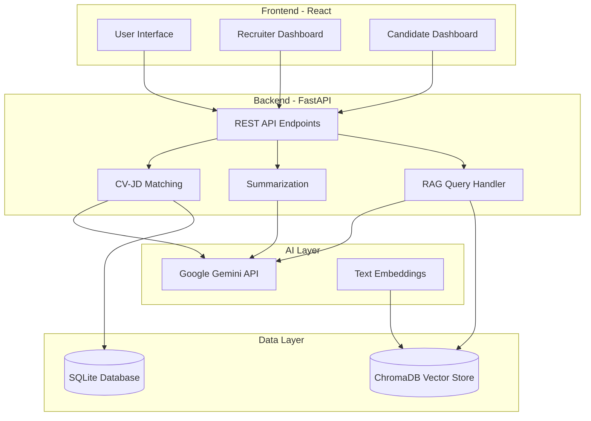

# Smart Recruitment Assistant

> AI-powered recruitment platform using RAG (Retrieval-Augmented Generation) for intelligent CV analysis and job matching.

[](https://www.python.org/downloads/)
[](https://reactjs.org/)
[](https://fastapi.tiangolo.com/)
[](https://www.typescriptlang.org/)

---

## 🚀 Quick Start

### Prerequisites
- Python 3.9+
- Node.js 16+
- Google Gemini API Key ([Get it here](https://makersuite.google.com/app/apikey))

### Installation

```bash
# 1. Clone repository
git clone <repository_url>
cd SmartRecru

# 2. Backend setup
python -m venv venv
source venv/bin/activate  # Windows: .\venv\Scripts\activate
pip install -r requirements.txt

# 3. Configure environment
echo "GEMINI_API_KEY=your_api_key_here" > .env

# 4. Frontend setup
cd app
npm install
cd ..

# 5. Run application
# Terminal 1 (Backend)
uvicorn api.main:app --reload --port 8000

# Terminal 2 (Frontend)
cd app && npm run dev
```

Open [http://localhost:5173](http://localhost:5173) in your browser.

📖 **Detailed Setup**: See [Setup Guide](./docs/setup.md)

---

## 🐳 Docker Quick Start

### Prerequisites
- Docker Desktop (Windows/Mac) or Docker Engine (Linux)
- Docker Compose V2
- Google Gemini API Key ([Get it here](https://makersuite.google.com/app/apikey))

### Run with Docker

```bash
# 1. Clone repository
git clone <repository_url>
cd SmartRecru

# 2. Configure environment
echo "GEMINI_API_KEY=your_api_key_here" > .env

# 3. Run in development mode (with hot reload)
docker-compose --profile dev up -d

# OR run in production mode
docker-compose --profile prod up -d

# 4. View logs
docker-compose logs -f

# 5. Stop services
docker-compose down
```

**Access the application:**
- Frontend: [http://localhost:5173](http://localhost:5173)
- Backend API: [http://localhost:8000](http://localhost:8000)
- API Documentation: [http://localhost:8000/docs](http://localhost:8000/docs)

**Useful Docker commands:**
```bash
# Rebuild services after code changes
docker-compose build

# View running containers
docker-compose ps

# Access backend logs
docker-compose logs backend

# Execute commands in backend container
docker-compose exec backend python -m pytest

# Clean up volumes (WARNING: deletes data)
docker-compose down -v
```

📖 **Docker Details**: See [Docker Documentation](./docs/docker.md)

---

## ✨ Features

### For Recruiters
- 📄 **Upload & Parse CVs** - Multi-format support (PDF, DOCX, TXT)
- 🎯 **Intelligent Matching** - AI-powered CV-JD matching with multi-factor scoring
- 📊 **Analytics Dashboard** - Visual insights into candidate pipeline
- 💬 **Ask AI** - RAG-powered Q&A about candidates (3 query modes)
- 🗃️ **Candidate Database** - Centralized management of all candidates
- 📈 **Comparison Tool** - Side-by-side candidate analysis

### For Candidates
- ✅ **Job Fit Analysis** - Instant compatibility score with target roles
- 🎓 **Skill Gap Identification** - See what skills you have vs. need
- 💡 **AI Career Coach** - Get personalized career advice
- 🎯 **Actionable Recommendations** - Tailored suggestions for improvement
- 📚 **Learning Resources** - Curated courses for missing skills

📖 **Full Features List**: See [Features Documentation](./docs/features.md)

---

## 🏗️ Architecture



### Technology Stack

**Frontend**
- React 18 + TypeScript
- Vite (Build Tool)
- Tailwind CSS (Styling)
- Recharts (Data Visualization)
- Axios (HTTP Client)

**Backend**
- FastAPI (Python Framework)
- Google Gemini 2.0 Flash (LLM)
- ChromaDB (Vector Database)
- SQLite + SQLAlchemy (Relational Database)
- PyMuPDF, python-docx (Document Processing)

**AI Components**
- Embeddings: `text-embedding-004` (768 dimensions)
- RAG: Custom implementation with ChromaDB
- Matching: Multi-factor semantic similarity

📖 **Architecture Details**: See [Architecture Documentation](./docs/architecture.md)

---

## 📚 Documentation

Comprehensive documentation is available in the [`/docs`](./docs) folder:

| Document | Description |
|----------|-------------|
| [**Setup Guide**](./docs/setup.md) | Installation, configuration, and deployment |
| [**Features**](./docs/features.md) | Detailed feature descriptions for all users |
| [**API Reference**](./docs/api.md) | Complete API documentation with examples |
| [**Architecture**](./docs/architecture.md) | System design and technical architecture |
| [**RAG System**](./docs/rag.md) | In-depth RAG implementation details |
| [**Documentation Index**](./docs/README.md) | Guide to all documentation |

---

## 🎯 Use Cases

### Recruiter Workflow
```
1. Upload Job Description → 2. Upload CVs → 3. View Match Results →
4. Ask AI Questions → 5. Compare Candidates → 6. Make Decision
```

### Candidate Workflow
```
1. Upload CV → 2. Upload Target Job → 3. View Fit Analysis →
4. Review Skill Gaps → 5. Get Recommendations → 6. Chat with AI Coach
```

---

## 🔧 Configuration

### Environment Variables

Create a `.env` file in the project root:

```env
# Required
GEMINI_API_KEY=your_gemini_api_key_here

# Optional (with defaults)
DATABASE_URL=sqlite:///./recruitment.db
CHROMA_PERSIST_DIR=./chroma_db
MAX_UPLOAD_SIZE=10485760  # 10MB
```

### API Endpoints

- **Backend API**: `http://localhost:8000`
- **API Docs**: `http://localhost:8000/docs` (Swagger UI)
- **Frontend**: `http://localhost:5173`

---

## 🔬 Project Structure

```
SmartRecru/
├── api/                    # FastAPI backend
│   ├── routes/            # API endpoints
│   ├── models.py          # Database models
│   ├── schemas.py         # Pydantic schemas
│   └── main.py            # FastAPI app entry
├── app/                   # React frontend
│   ├── components/        # React components
│   ├── services/          # API clients
│   ├── types.ts           # TypeScript types
│   └── main.tsx           # React entry
├── src/                   # Python source code
│   ├── ai/               # AI components (matching, RAG, summarization)
│   └── pipelines/        # Data processing pipelines
├── docs/                  # Documentation
│   ├── README.md         # Documentation index
│   ├── architecture.md   # System architecture
│   ├── api.md           # API reference
│   ├── features.md      # Features guide
│   ├── setup.md         # Installation guide
│   └── rag.md           # RAG system details
├── tests/                 # Test files
├── chroma_db/            # ChromaDB storage
├── requirements.txt      # Python dependencies
├── package.json          # Node dependencies
└── .env                  # Environment config
```

---

## 🌟 Key Features Highlight

### RAG-Powered Q&A System

Ask natural language questions about candidates:

```
Recruiter: "Who has the most Python experience?"
AI: "Sarah Johnson has 8 years of Python experience, primarily in backend
    development and data science. She has worked on multiple large-scale
    projects including..."

```

**3 Query Modes**:
- 🎯 **Specific Candidate**: Ask about one candidate
- 💼 **All CVs for Job**: Compare candidates for a position
- 📊 **All Candidates**: Query entire database with filters

### Intelligent Matching

Multi-dimensional scoring system:
- **Semantic Similarity** (40%): Overall profile-role alignment
- **Skills Match** (30%): Technical and soft skills overlap
- **Experience** (20%): Years and relevance
- **Education** (10%): Degree and institution

Output: Match score (0-100%), Grade (A+/A/B/C/D), detailed insights

---

## 🐛 Troubleshooting

### Common Issues

**Gemini API Key Error**
```bash
# Verify .env file exists and contains valid API key
cat .env
# Should show: GEMINI_API_KEY=your_key_here
```

**Frontend Can't Connect to Backend**
```bash
# Ensure backend is running on port 8000
curl http://localhost:8000/health
# Expected: {"status": "healthy"}
```

**ChromaDB Errors**
```bash
# Reset ChromaDB
rm -rf chroma_db
# Restart backend - ChromaDB will reinitialize
```

📖 **More Solutions**: See [Troubleshooting Guide](./docs/setup.md#troubleshooting)

---

## 📊 Tech Specs

| Component | Technology | Version |
|-----------|-----------|---------|
| Python | CPython | 3.9+ |
| Node.js | Node | 16+ |
| React | JavaScript Library | 18.x |
| FastAPI | Python Framework | 0.104+ |
| Gemini | LLM | 2.0 Flash |
| ChromaDB | Vector DB | Latest |
| SQLite | SQL DB | 3.x |
| TypeScript | Language | 5.0+ |
| Tailwind | CSS Framework | 3.x |

---

## 🙏 Acknowledgments

- **Google AI** - Gemini API for LLM and embeddings
- **ChromaDB** - Vector database for RAG
- **FastAPI** - Modern Python web framework
- **React** - UI library
- **Tailwind CSS** - Utility-first CSS

---

## 📧 Contact

For questions or support:
- **Issues**: Submit on GitHub
- **Documentation**: See [`/docs`](./docs)
- **API Docs**: Visit `http://localhost:8000/docs` when running

---

## 🗺️ Roadmap

### Completed ✅
- [x] CV parsing and analysis
- [x] Job description processing
- [x] Multi-factor matching algorithm
- [x] RAG-powered Q&A (3 modes)
- [x] Recruiter and candidate dashboards
- [x] Database management
- [x] Source attribution
- [x] Markdown formatting

### Planned 🚀
- [ ] Multi-language support
- [ ] Email integration
- [ ] Resume builder
- [ ] Interview scheduling
- [ ] Candidate tracking system
- [ ] Advanced analytics
- [ ] API authentication
- [ ] Role-based access control

---

