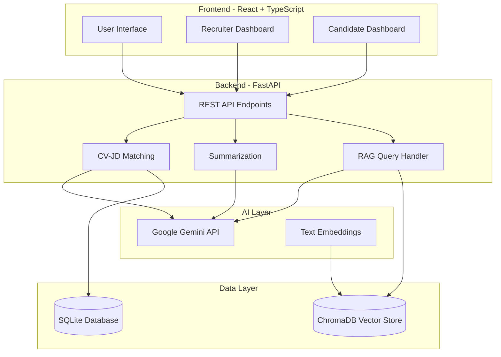

# Smart Recruitment Assistant - Architecture Overview

## System Architecture

The Smart Recruitment Assistant is a full-stack AI-powered recruitment platform that uses RAG (Retrieval-Augmented Generation) to provide intelligent CV analysis and job matching.

### High-Level Architecture



## Technology Stack

### Frontend
- **Framework**: React 18 with TypeScript
- **Build Tool**: Vite
- **Styling**: Tailwind CSS
- **Charts**: Recharts
- **HTTP Client**: Axios

### Backend
- **Framework**: FastAPI (Python)
- **LLM**: Google Gemini 2.0 Flash
- **Vector Database**: ChromaDB
- **SQL Database**: SQLite with SQLAlchemy ORM
- **Document Processing**: PyMuPDF, python-docx

### AI Components
- **Embeddings**: Google Generative AI Embeddings (`text-embedding-004`)
- **LLM**: Gemini 2.0 Flash Experimental
- **RAG Framework**: Custom implementation with ChromaDB

## System Components

### 1. Frontend Layer

**Location**: `/app`

#### Components
- **RecruiterDashboard**: Multi-tab interface for recruiters
  - Upload CVs and Job Descriptions
  - View match results and analytics
  - RAG-powered AI assistant
  - Manage all candidates database
  
- **CandidateDashboard**: Interface for job seekers
  - Upload CV and target job description
  - View fit analysis and recommendations
  - AI career coach assistant

#### Services
- **apiBackend.ts**: API client for all backend communication
- Handles file uploads, RAG queries, and data fetching

### 2. Backend Layer
   
**Location**: `/api`

#### API Routes (`/api/routes`)
- **upload.py**: File upload and parsing
- **match.py**: CV-JD matching logic
- **rag.py**: RAG query endpoints
- **database.py**: Database management
- **candidates.py**: Candidate CRUD operations

#### Models (`/api/models.py`)
- `Candidate`: Stores candidate profiles and match results
- `JobDescription`: Stores job descriptions
- SQLAlchemy ORM models

#### Schemas (`/api/schemas.py`)
- Pydantic models for request/response validation
- Type safety across API boundaries

### 3. AI Processing Layer

**Location**: `/src/ai`

#### Core AI Modules
- **matching.py**: Semantic CV-JD matching
  - Calculates match scores (semantic, skills, experience, education)
  - Generates grades (A+, A, B, C, D)
  - Identifies strengths and weaknesses

- **qa.py**: RAG-based Q&A system
  - Persona-aware responses (recruiter vs candidate)
  - Context-aware answer generation

- **rag.py**: RAG pipeline implementation
  - Document chunking (500 char chunks, 50 overlap)
  - Vector indexing with ChromaDB
  - Semantic search and retrieval

- **summarization.py**: Text summarization
  - CV summaries
  - Job description summaries
  - Match analysis summaries

### 4. Data Processing Layer

**Location**: `/src/pipelines`

#### Pipelines
- **extraction.py**: Extract text from documents (PDF, DOCX, TXT)
- **preprocessing.py**: Clean and normalize text
- **ner.py**: Named Entity Recognition for skill extraction

### 5. Data Storage Layer

#### SQLite Database
- **Purpose**: Structured data storage
- **Schema**: 
  - Candidates table
  - Job descriptions table
  - Match history

#### ChromaDB Vector Store
- **Purpose**: Vector embeddings for semantic search
- **Collections**:
  - `all_cvs`: All indexed CVs
  - `job_descriptions`: All indexed JDs
  - `job_{job_id}`: Job-specific collections (JD + related CVs)

## Data Flow

### 1. CV Upload and Indexing

```
User uploads CV → FastAPI receives file → Extract text (PyMuPDF/docx) →
Gemini analyzes CV → Store in DB → Chunk text → Generate embeddings →
Store in ChromaDB → Return candidate profile
```

### 2. CV-JD Matching

```
User provides CV + JD → Extract both texts → Gemini compares →
Calculate multi-factor scores → Generate recommendations →
Store in DB → Return match result with insights
```

### 3. RAG Query Flow

```
User asks question → Determine query mode (specific/all-job/all-database) →
Query ChromaDB for relevant chunks → Retrieve top-k passages →
Extract source metadata → Build context → Send to Gemini →
Generate answer with sources → Return formatted response
```

## Security & Configuration

### Environment Variables
- `GEMINI_API_KEY`: Google AI API key
- `DATABASE_URL`: SQLite database path (optional)
- `CHROMA_PERSIST_DIR`: ChromaDB storage path

### API Rate Limiting
- Gemini API: Subject to Google's quota limits
- Recommended: Implement caching for repeated queries

## Deployment Architecture

### Development
```
Frontend (Vite Dev Server :5173) ← Proxy → Backend (Uvicorn :8000)
```

### Production
```
Frontend (Static Build) → CDN/Nginx
Backend (Uvicorn/Gunicorn) → Reverse Proxy → Load Balancer
```

## Performance Considerations

### Optimization Strategies
1. **Caching**: Cache frequently accessed embeddings
2. **Batch Processing**: Batch multiple CV uploads
3. **Lazy Loading**: Load candidate data on demand
4. **Debouncing**: Debounce search queries
5. **Pagination**: Paginate large result sets

### Scalability
- **Horizontal Scaling**: Multiple FastAPI instances
- **Database**: Migrate to PostgreSQL for production
- **Vector Store**: ChromaDB supports distributed mode
- **Caching Layer**: Redis for session/query caching

## Error Handling

### Frontend
- User-friendly error messages
- Retry mechanisms for API calls
- Loading states and skeletons

### Backend
- Structured error responses
- Logging with contextual information
- Graceful degradation

## Monitoring & Observability

### Recommended Tools
- **Logging**: Python `logging` module
- **Metrics**: Prometheus + Grafana
- **Tracing**: OpenTelemetry
- **Health Checks**: `/health` endpoint

---

**Next**: See [API Documentation](./api.md) for detailed endpoint specifications.
